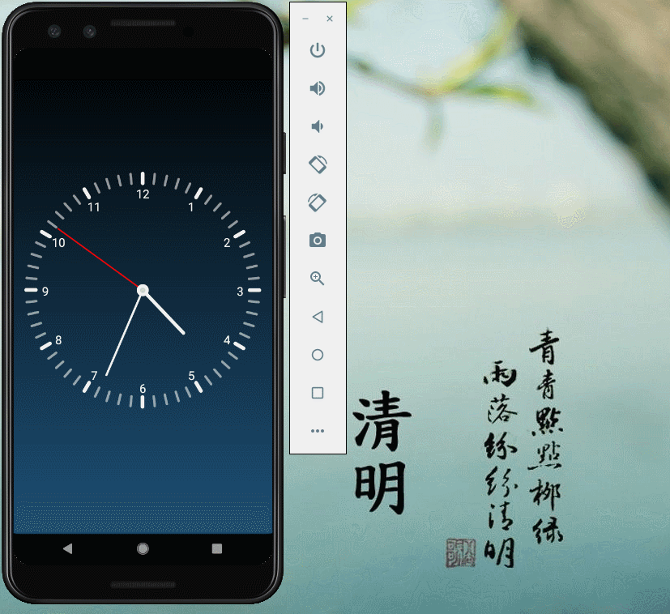

# Summer_ByteDance_AndroidCamp
大二下小学期

## Chapter 1

作业要求：

1. 创建一个Android app工程，包含一个activity
2. 使用5种以上的View并实现一些简单交互：ImageView, Button, TextView, RadioButton, CheckBox,
   EditText, ProgressBar, SeekBar, Switch 等等不限
3. 将一些交互结果输出log
4. 打包生成apk

**作业成果：**

logout输出：

APK文件输出：

-----

## Chapter 2

作业要求：

实现RecyclerView

**实现结果：**

**Advanced Task:**

利用itemDecoration实现分割线的绘制。

自定义间隔样式需要继承`RecyclerView.ItemDecoration`类，然后override onDraw方法即可。

结果如上图所示。

----

## Chapter 3

**作业要求：**

* ex1:  SeekBar + Lottie

* ex2:  添加 scale 动画 

  ​         添加 alpha 动画

  ​         组合到 AnimatorSet

* ex3(加分项):  TabLayout + ViewPager 

**实现结果：**

以下是录制的gif：

加分项界面截图：

**Advanced Task:**

首先实现ex3 activity 的xml文件，里面有TabLayout和ViewPager。

实现自定义MyViewPagerAdapter类，继承自FragmentPagerAdapter，override其中必要的方法

ex3 activity中实现对TabLayout和ViewPager内容的设定，其中ViewPager内容的设定借助MyViewPagerAdapter实现。

实现三个自定义的Fragment类（ZjuFragment，BytedanceFragment，AndroidFragment）以及相应的xml文件，在ex3 activity中实例化即可。

------

## Chapter 4

**作业要求：**

**实验结果：**

以下是程序运行的gif图片：

测试翻转的gif：

**Android Profiler分析器：**

利用内存分析器**memory profiler**可以帮助检查是否出现**内存泄漏**。

内存分析器是Android Profiler中的一个组件，它可以帮助识别内存泄漏和内存溢出。它显示了应用程序内存使用的实时图，方便开发者跟踪内存分配。

经检测，可以看到memory的使用情况随着程序的运行保持平稳，说明没有内存泄漏。