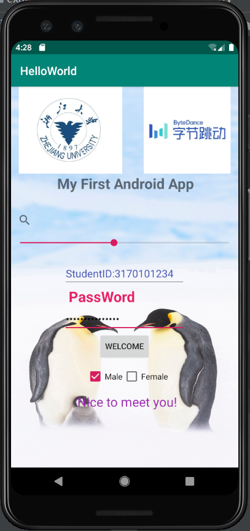

# Summer_ByteDance_AndroidCamp
大二下小学期

## Chapter 1

作业要求：

1. 创建一个Android app工程，包含一个activity
2. 使用5种以上的View并实现一些简单交互：ImageView, Button, TextView, RadioButton, CheckBox,
   EditText, ProgressBar, SeekBar, Switch 等等不限
3. 将一些交互结果输出log
4. 打包生成apk

**作业成果：**

logout输出：

APK文件输出：

-----

